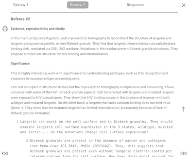

# \<render-rev>

Visualizing the peer review process.

render-rev is a [Web Components](https://developer.mozilla.org/en-US/docs/Web/Web_Components)-based Javascript package
that fetches data about the peer review process of a preprint and displays it in the form of a timeline.
The timeline contains the most important points of the process such as reviews and author replies:


If available, the full text of peer reviews and author replies can be viewed in a built-in reader:



## DocMaps

All data about the review process is fetched from the [Early Evidence Base (EEB)](https://eeb.embo.org/) API in the DocMaps format.

The DocMaps framework is used at EMBO Press to describe the peer review process that a scientific article went through.
Given the DOI of an article, the EEB service returns a list of DocMap objects that each describe a single round of the peer review process.

A DocMap consists of one or more ordered steps.
Each step has inputs, and actions that were taken during the step, outputs, and assertions about the article that hold after this step.

As an example, a round of reviews with 3 peer reviews and a reply by the article authors could consist of two steps:
1. Step: reviews
   - input: the article under review
   - actions: 3 referees each writing a review
   - outputs: the 3 reviews
   - assertion: that the article is peer-reviewed
2. Step: author reply
   - inputs: the 3 reviews from the previous step
   - action: the article authors writing a reply to the reviews
   - output: an author reply
   - assertion: that the article authors have replied to the reviews

The DocMaps documentation can be found at [https://docmaps.knowledgefutures.org/pub/sgkf1pqa/release/7](https://docmaps.knowledgefutures.org/pub/sgkf1pqa/release/7)

## Installation

```bash
npm i render-rev
```

## Usage

Importing the render-rev package automatically register the \<render-rev> custom element.
Use this element and pass it the DOI of the preprint you want to display:

```html
<script type="module">
  import 'render-rev/render-rev.js';
</script>

<render-rev doi="10.1101/2020.07.20.212886"></render-rev>
```

## Customization

To customize the look of the rendered review process, or to pass in data from an
external source, use the `.configure()` method of the element:

```html
<render-rev id="render-rev-0"></render-rev>

<script type="module">
  import 'render-rev/render-rev.js';
  const renderRevElement = document.getElementById('render-rev-0');
  renderRevElement.configure({
    doi: '10.1101/2020.07.20.212886',
    display: {
      publisherName: name => name.toUpperCase(),
    }
  });
</script>
```

### Configuration Options

* `debug`: Passing a truthy value activates detailed logging during DocMaps parsing.
* `docmaps`: Pass in an array of DocMaps that represent the review process of a preprint. Overrides both the configuration option and the custom element attribute named `doi`.
* `doi`: Display the review process of the preprint with this DOI. Overrides the value passed to the `doi` custom element attribute.
* `display`: Pass in an object to configure how the review process is displayed with one of the following keys:
  * `formatDate`: A callable that receives a Date object and returns a string representation of this date. Dates passed to this function are displayed in the timeline and above the full-text of reviews and responses in the highlight viewer. By default dates are formatted as `<Name of month abbreviated> <Day of month>, <Year>`, e.g. `Feb 24, 2020`.
  * `publisherLogo`: A callable that receives the name of a publisher and returns a URL to the icon that should be displayed next to the publisher's name, or a falsy value if no icon should be displayed. By default always returns null, i.e. no icons are displayed for any publisher. Example:
    ```Javascript
    {
      publisherLogo: name => {
        const publisherLogosById = {
          'bioRxiv': 'https://www.biorxiv.org/sites/default/files/images/favicon.ico',
          'embo press': 'https://www.embopress.org/favicon.ico',
        }
        return publisherLogosById[name] || null;
      }
    }
    ```
  * `publisherName`: A callable that receives the name of a publisher and returns how it should be displayed. This publisher name is what's displayed on the left side of the timeline. The default is to return the received name unchanged for unknown publishers and use the correct capitalization for known publishers like bioRxiv, EMBO Press, etc. Can be used to e.g. correct capitalization or use abbreviations:
    ```Javascript
    {
      publisherName: name => {
        const publisherNamesById = {
          'elife': 'eLife',
          'embo journal': 'EMBOJ',
        }
        return publisherNamesById[name] || name;
      }
    }
    ```
  * `renderMarkdown`: A callable that takes a Markdown-formatted string and return an HTML representation of it. Is used to render the full text of reviews and replies. Uses the very small [drawdown library](https://github.com/adamvleggett/drawdown/) by default. Other possibilites are e.g. [marked](https://github.com/markedjs/marked) or [markdown-it](https://github.com/markdown-it/markdown-it):
    ```Javascript
    { renderMarkdown: marked.parse }
    ```

## Development

The project is scaffolded with [Open Web Components](https://open-wc.org/) and built with [Lit](https://lit.dev/).

### Linting and formatting

To scan the project for linting and formatting errors, run

```bash
npm run lint
```

To automatically fix linting and formatting errors, run

```bash
npm run format
```

### Testing with Web Test Runner

To execute a single test run:

```bash
npm run test
```

To run the tests in interactive watch mode run:

```bash
npm run test:watch
```


### Tooling configs

For most of the tools, the configuration is in the `package.json` to minimize the amount of files in the project.

### Local Demo with `web-dev-server`

```bash
npm start
```

To run a local development server that serves the basic demo located in `demo/index.html`
